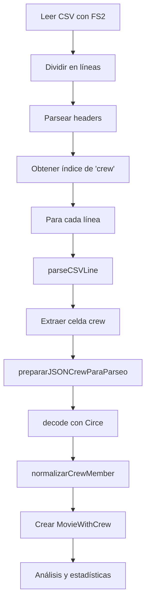

# Limpieza de Crew - Documentación Completa

##  Descripción

Este módulo se enfoca *exclusivamente en la limpieza y procesamiento de la columna crew* del dataset de películas. Utiliza *Circe* para parsear JSON malformado y *FS2* para procesamiento funcional de archivos.

---

##  Problemas Solucionados

### Problema 1: JSON Malformado (Formato Python)
El CSV contiene JSON en formato Python que no es válido para parsers JSON estándar:
```python
# CSV original (formato Python)
[{'name': 'John', 'job': 'Director', 'id': None, 'gender': True}]
```

*Solución*:
```scala
def prepararJSONCrewParaParseo(crew: String): String =
  crew.trim
    .replaceAll("'", "\"")           // ' → "
    .replaceAll("None", "null")      // None → null
    .replaceAll("True", "true")      // True → true
    .replaceAll("False", "false")    // False → false
    .replaceAll("""\\""", "")        // Eliminar escapes
```

### Problema 2: CSV con ; dentro de JSON
El CSV usa ; como separador, pero el JSON también puede contener ;:
```csv
123;Avatar;"[{'name': 'Cameron; James', 'job': 'Director'}]";...
```

*Solución*: Parser de CSV con estado que respeta comillas:
```scala
def parseCSVLine(line: String): Array[String] =
  // Usa fold con estado (fields, current, inQuotes)
  // Solo separa por ';' cuando NO está entre comillas
```

---

##  Estructura del Código

### 1. Modelos de Datos
```scala
// Modelo del crew member (todos los campos opcionales por seguridad)
case class Crew(
  credit_id: Option[String],
  department: Option[String],
  id: Option[Int],
  job: Option[String],
  name: Option[String],
  profile_path: Option[String]
)

// Modelo que mantiene contexto de película
case class MovieWithCrew(
  movieId: Double,
  title: String,
  crew: List[Crew]
)
```

### 2. Utilidades de Limpieza

#### prepararJSONCrewParaParseo
Convierte JSON de formato Python a formato JSON válido.

#### normalizarTexto
Normaliza strings: elimina espacios múltiples y convierte vacíos a None.
```scala
"  John   Smith  " → Some("John Smith")
"" → None
"   " → None
```

#### normalizarCrewMember
Aplica normalización a todos los campos de un Crew.

#### parseCSVLine
Parsea líneas CSV respetando comillas (tu brillante implementación).

#### parsearCrewDeCelda
Parsea la celda de crew completa: limpia JSON → decodifica → normaliza.

---

##  Flujo de Procesamiento


---

## 📊 Output del Programa
```
1. ESTADÍSTICAS GENERALES
--------------------------------------------------------------------------------
Películas procesadas:                3.227
Total crew members (únicos):        26.419
Directores:                          2.605
Miembros de Producción:              5.266
Escritores:                          4.698
```

---

##  Errores Comunes y Soluciones

### Error 1: "Got value with wrong type, expecting string"

**Error completo**:
```
Error parseando crew: DecodingFailure at [0].id: Got value '4109' with wrong type, expecting string
```

**Causa**: El JSON contiene números (`id: 4109`, `gender: 2`) pero el case class los tiene como `String`.

**Solución**: Cambiar los tipos en el case class:
```scala

case class Crew(
  id: Option[String],      // ← Error
  gender: Option[String]   // ← Error
)

case class Crew(
  id: Option[Int],         // ← Números son Int
  gender: Option[Int]      // ← 0=N/A, 1=Female, 2=Male
)
```

### Error 2: "object LimpiezaCrew is not a member"

**Causa**: Problema de package o ubicación del archivo.

**Solución**: Verificar que:
- Si el archivo está en `src/main/scala/clases/`, debe tener `package clases`
- Si está en `src/main/scala/`, NO debe tener package
- Ejecutar con el path correcto: `sbt "runMain clases.LimpiezaCrew"`

### Error 3: No muestra nada al ejecutar

**Causa**: Extendiendo `App` en lugar de `IOApp.Simple`.

**Solución**:
```scala

object LimpiezaCrew extends App:

object LimpiezaCrew extends IOApp.Simple:
```

---

## Información del Proyecto

**Autor**: Andrés Yaguachi  
**Proyecto**: Practicum - Limpieza de Datos de Películas  
**Tecnologías**: Scala 3, Cats Effect, FS2, Circe  
**Fecha**: Enero 2026


